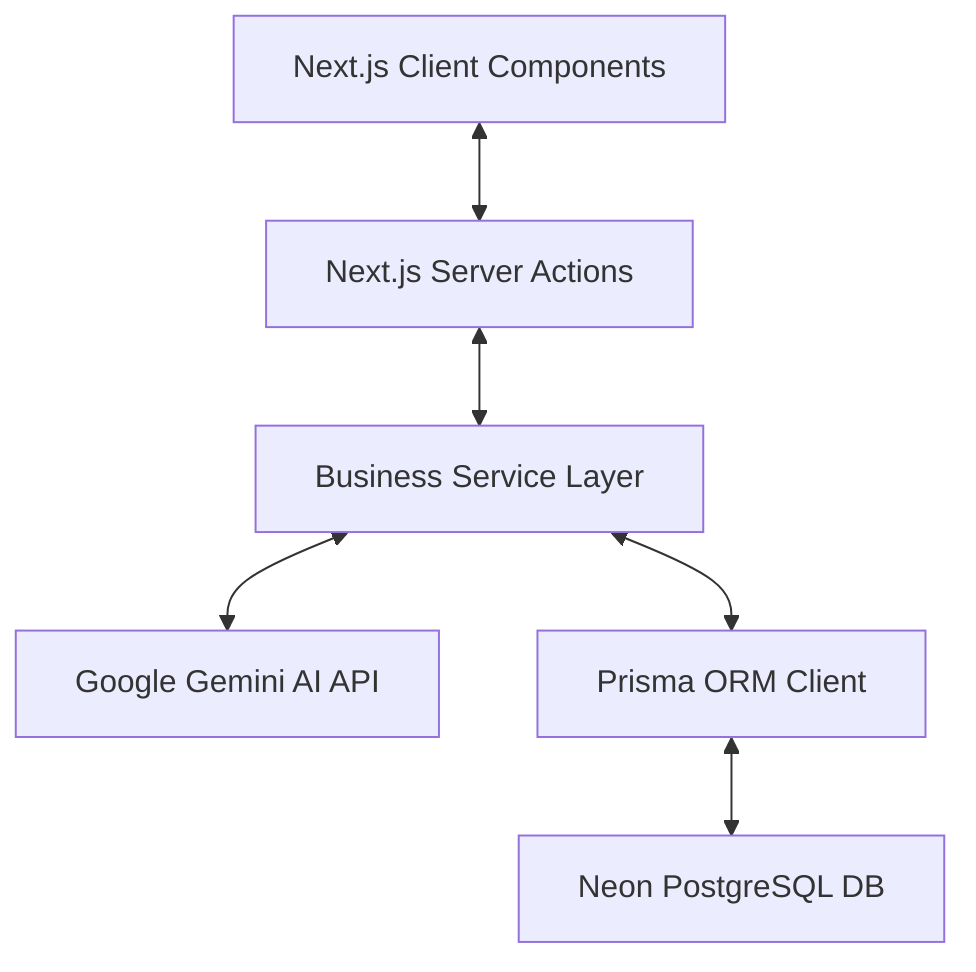
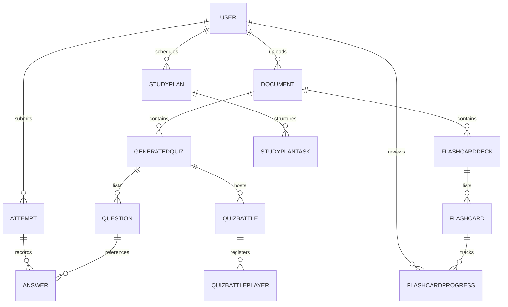

# Technical Specification: StudyTest AI

StudyTest AI is a premium, AI-powered learning workspace designed to help students master academic concepts. Students upload study documents (PDFs, lectures) and let AI synthesize interactive roadmaps, personalized flashcard decks, diagnostic cockpits, concept flowcharts, audio podcasts, and multi-player quiz sessions.

---

## 🏗️ Architecture & Technology Stack

### Frontend
* **Framework**: Next.js 16 (App Router, Turbopack bundling).
* **Styling**: Tailwind CSS v4 featuring adaptive CSS variables for dark/light modes.
* **UI Primitives Library**: Reusable design controls inside `components/ui/` (`Button`, `Card`, `Modal`, `Badge`, `ProgressBar`) ensuring theme uniformity.
* **Icons**: Lucide React.
* **Interactive Elements**: Mermaid.js for flowcharts, SpeechSynthesis API for local text-to-speech audio rendering.

### Backend & Data
* **Server-side Logic**: Next.js Server Actions (`"use server"`) providing secure RPC-like endpoints.
* **Database**: PostgreSQL hosted on Neon.tech.
* **ORM**: Prisma Client v7 (configured with customized output mappings for type safety).
* **Authentication**: Auth.js (NextAuth v5) supporting Google SSO (with Google API calendar integration scopes) and dangerous account linking.

---

## 🗄️ Database Architecture

The schema contains 14 tables tracking users, documents, evaluation results, flashcards, scheduler plans, and real-time multiplayer lobbies.

### Models Detail

#### 1. User (`users`)
* Tracks profile, streak info, SSO accounts, and gamification properties.
* Fields: `id`, `name`, `email`, `streakCount`, `lastStudyDate`, `badges` (JSON list), `xp`, `gold`, `level`, `unlockedThemes` (JSON list), `activeTheme`, `activeTitle`.

#### 2. Document (`documents`)
* Tracks uploaded library sources, raw texts, layout outlines, and scripts.
* Fields: `id`, `userId`, `title`, `filename`, `filePath`, `fileSize`, `pageCount`, `extractedText`, `visualOutline`, `podcastScript`, `status` (Enum), `uploadedAt`.

#### 3. GeneratedQuiz (`generated_quizzes`)
* Stores quizzes synthesized by AI from documents. Includes sharing logic.
* Fields: `id`, `documentId`, `title`, `questionCount`, `shareCode`, `format` (Enum: MCQ, TRUE_FALSE, SHORT_ANSWER, FILL_IN_THE_BLANKS), `timeLimit`, `createdAt`.

#### 4. Question (`questions`)
* Contains actual quiz questions, multiple choice options, correct values, and concept metadata.
* Fields: `id`, `quizId`, `question`, `options` (JSON string list), `correctAnswer`, `explanation`, `difficulty` (Enum), `topic`, `type` (Enum: MCQ, TRUE_FALSE, SHORT_ANSWER, FILL_IN_THE_BLANKS), `orderIndex`.

#### 5. Attempt (`attempts`)
* Tracks a student's performance on a quiz, including AI generated advice.
* Fields: `id`, `userId`, `quizId`, `score`, `totalQuestions`, `percentage`, `timeSpentSeconds`, `aiFeedback`, `mode`, `startedAt`, `completedAt`.

#### 6. Answer (`answers`)
* Links individual student responses back to quiz questions.
* Fields: `id`, `attemptId`, `questionId`, `selectedAnswer`, `isCorrect`, `aiExplanation`.

#### 7. StudyPlan & StudyPlanTask (`study_plans`, `study_plan_tasks`)
* The core daily scheduler structures. Day-by-day task details, topics, and estimated completion times.
* Plan Fields: `id`, `userId`, `title`, `targetDate`, `dailyMinutes`.
* Task Fields: `id`, `planId`, `dayNumber`, `date`, `topic`, `description`, `estimatedMinutes`, `isCompleted`.

#### 8. FlashcardDeck, Flashcard & Progress (`flashcard_decks`, `flashcards`, `flashcard_progress`)
* Leitner system spaced repetition tracking structures.
* Deck Fields: `id`, `documentId`, `title`, `cardCount`, `shareCode`.
* Card Fields: `id`, `deckId`, `front`, `back`.
* Progress Fields: `id`, `userId`, `cardId`, `interval`, `repetitions`, `easeFactor`, `nextReview`.

#### 9. QuizBattle & Player (`quiz_battles`, `quiz_battle_players`)
* Real-time multiplayer test lobbies.
* Battle Fields: `id`, `quizId`, `hostId`, `status` (`LOBBY` | `ACTIVE` | `FINISHED`).
* Player Fields: `id`, `battleId`, `userId`, `userName`, `progress`, `score`, `finishedAt`, `timeSpent`.

---

## 🚀 Key Premium Features

### 1. 🎙️ AI Lecture Podcast (Alex & Taylor)
* **AI Generation**: Leverages structured LLM prompts (`ai.service.ts`) to produce a co-host debate script formatted into alternating turns (`[Alex]: ...` and `[Taylor]: ...`).
* **Audio Playback Queue**: Built using browser `SpeechSynthesis` APIs. Uses voice lists to select a male-sounding voice (Alex) and a female-sounding voice (Taylor), altering speed dynamically (0.75x to 2x).
* **Responsive Visualizer**: Displays bouncing frequency bars syncing with synthesis callbacks, and triggers auto-scroll to lock view focus on the active speaker turn.

### 2. 🕸️ Concept Mind-Map Interactive Explorer
* **Hierarchy Graph**: Renders dynamic flowcharts using Mermaid diagram definitions.
* **Explorer Sidebar**: Parses Mermaid diagram markup on-the-fly, list-displays concepts in a clickable navigation menu, and enables prompt shortcuts ("Explain in Chat" or "Practice Quiz") to seed the chat tutor panel.

### 3. 🎯 AI Weakness Diagnostic Cockpit
* **Aggregation Action**: Analyzes quiz attempt logs, groups incorrect answers by `question.topic`, and calculates accurate topic-specific percentages.
* **Knowledge Heatmap**: Adaptive cards display topic mastery (flags low-accuracy areas below 70%). The homepage dashboard view is limited to the top 4 weakest concepts, with a link routing to a dedicated `/dashboard/diagnostics` subpage rendering the full diagnostic heatmap.
* **🔥 Slay Weaknesses**: A single-click remediation trigger that requests AI to build a targeted remedial Leitner study deck covering the student's weakest topics.

### 4. ⚔️ RPG Gamified Questboard & Merchant Shop
* **Leveling Formula**: Completing study quests yields `+50 XP` and `+10 Gold` (unchecking task reverts rewards). Leveling up triggers automatically at `Level * 100` XP.
* **Merchant Shop**: A modular shop dialog where players spend study gold to acquire scholastic Titles ("Fullstack Conqueror") and adaptive custom layout themes ("Neon Cyberpunk", "Lofi Cafe").
* **Adaptive Theme Overrides**: Custom visual configurations (background containers, card styles, and text values) automatically adapt to respect the browser's light/dark mode triggers.

---

## ⚙️ Service Integrations

### 1. Gemini AI Services (`services/ai.service.ts`)
* Configured using `GoogleGenAI` library client hooks.
* Handlers:
  * `parseDocumentText`: Extracts outline maps and content hierarchies.
  * `generatePodcastScript`: Forges co-host lectures.
  * `generateQuizFromText`: Compiles question cards, explanations, and difficulty rankings.
  * `generateFlashcardsForTopics`: Compiles remediation cards for specific weak topics.

### 2. Analytical Engine (`services/analytics.service.ts`)
* Computes KPIs for the main student dashboard:
  * `getDashboardStats`: Aggregates total quizzes completed, questions answered, average scores, and best records.
  * `getScoreTrend`: Compiles date-wise performance logs.
  * `getTopicAnalysis`: Clusters quiz questions to calculate concept accuracy.

### 3. Spaced Repetition Engine (`services/flashcard.service.ts`)
* Computes interval schedules for study cards using an SM-2 (SuperMemo-2) algorithm.
* Adjusts ease factors (`easeFactor`) and repetition metrics based on self-reported answer difficulties (1 to 5 scale).

### 4. Digital Calendar Feed Sync (`app/actions/calendar.actions.ts`)
* **ICS Feed Generator**: Compiles daily tasks into standard `.ics` (iCalendar) strings for calendar imports (Apple, Outlook).
* **Google API Direct Sync**: Resolves consent prompts, fetches OAuth refresh tokens via Auth.js accounts database link, and pushes all scheduler tasks directly to the student's Google Calendar account as individual event items.
