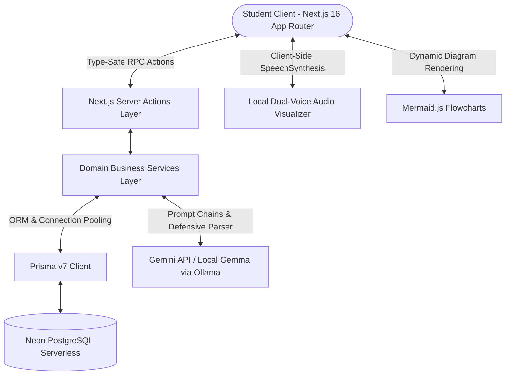

# 🏛️ Engineering Architecture & Technical Decisions: StudyTest AI

**Live Application URL**: [https://studytest-ai-nu.vercel.app](https://studytest-ai-nu.vercel.app)  
**Dashboard**: [https://studytest-ai-nu.vercel.app/dashboard](https://studytest-ai-nu.vercel.app/dashboard)

---

## 1. Executive Summary & Problem Framing

Digital learning suffers from the **"Passive Consumption Trap"**. Students aggregate massive amounts of PDFs, lecture slides, and notes, yet conventional digital tools treat these documents as static reading material. Decades of cognitive science research demonstrate that passive rereading yields poor retention compared to **active recall, diagnostic feedback loops, and algorithmic spaced repetition**.

### Core Product Hypothesis
> *If we can automatically transform unstructured academic materials into interactive, diagnostic study workflows (adaptive quizzes, SM-2 flashcard decks, concept mind-maps, and multi-speaker audio lectures), students will retain significantly more knowledge with less cognitive fatigue.*

Rather than building a thin wrapper over an LLM chat endpoint, **StudyTest AI** is an end-to-end learning operating system that parses, structures, tests, and diagnoses student mastery across their academic materials.

---

## 2. Key Architectural Decisions & Trade-Offs

### 2.1 Next.js 16 App Router & Server Actions vs. Standalone Microservices
* **Decision**: Full-stack Next.js 16 App Router architecture utilizing Server Actions (`"use server"`) as a type-safe RPC boundary directly invoking domain services.
* **Rationale**:
  - **End-to-End Type Safety**: Shared TypeScript interfaces between database models, business logic, and UI components eliminate API contract drift and redundant DTO boilerplate.
  - **Atomic Transaction Boundaries**: Server Actions encapsulate multi-table writes within Prisma `$transaction` blocks without exposing intermediate REST endpoints.
  - **Zero-Cold-Start Serverless Runtime**: Server Actions compile to isolated serverless lambdas on Vercel/Node edge runtimes, minimizing infrastructure overhead and operational maintenance.
* **Trade-Off & Mitigation**: Serverless functions have execution limits (15–60s). For heavy document ingestion and AI generation, we structured requests with token budgeting, streaming feedback, and aggressive database caching.

---

### 2.2 Relational Database Model (PostgreSQL + Prisma) vs. NoSQL / Document Store
* **Decision**: Relational schema on PostgreSQL (Neon.tech) with Prisma ORM v7, adopting a hybrid normalization pattern.
* **Rationale**:
  - **Relational Integrity**: Deep relational dependencies (`User -> Document -> GeneratedQuiz -> Question -> Attempt -> Answer`) require foreign-key cascades, relational constraints, and aggregation queries (e.g., calculating topic-specific error rates across historical attempts).
  - **Hybrid Normalization**: Core business entities are fully normalized, while flexible data (MCQ option arrays, JSON badge unlocks, user preferences) are stored in Postgres `JSONB` columns to avoid costly multi-join queries for static sub-structures.
* **Trade-Off**: Schema changes require schema push/migration steps, but provide compile-time guarantees and typed query outputs across the codebase.

---

### 2.3 Spaced Repetition Engine: SuperMemo-2 (SM-2) Implementation
* **Decision**: Implemented an algorithmic spaced repetition system (`services/flashcard.service.ts`) using the SuperMemo-2 (SM-2) formula rather than static Leitner 3-box systems.
* **Mathematical Model**:
  - **Ease Factor (EF)**: Starts at default `2.5`. On each review with quality rating $q \in [0, 5]$:
    $$\text{EF}' = \text{EF} + (0.1 - (5 - q) \times (0.08 + (5 - q) \times 0.02))$$
  - **Lower Bound Clamping**: $\text{EF}' = \max(\text{EF}', 1.3)$ — preventing the **"interval collapse trap"** where difficult concepts become permanently over-scheduled and demoralize the learner.
  - **Interval Scheduling**:
    - If $q < 3$ (failure): repetitions reset to $0$, interval reset to $1$ day.
    - If $q \ge 3$ (success):
      - $n = 1 \implies I_1 = 1 \text{ day}$
      - $n = 2 \implies I_2 = 6 \text{ days}$
      - $n > 2 \implies I_n = \text{round}(I_{n-1} \times \text{EF})$
* **Rationale**: Adapts to individual concept difficulty dynamically over months of review cycles.

---

### 2.4 Browser Web Speech API vs. Cloud Text-to-Speech (TTS)
* **Decision**: Implemented a browser-native audio synthesis engine using the Web Speech (`SpeechSynthesis`) API for the **Alex & Taylor AI Podcast** study feature.
* **Rationale**:
  - **Zero Streaming Latency & Zero Running Cost**: Audio is synthesized entirely on the client's device without incurring per-character costs (e.g., ElevenLabs / OpenAI Audio API) or streaming buffering delays.
  - **Dynamic Turn Management**: The client parses dialogue tokens (`[Alex]:`, `[Taylor]:`) and alternates between pitch-shifted male/female voices while driving an animated frequency visualizer.
* **Trade-Off**: Voice fidelity depends on local OS voice engines. In a commercial enterprise deployment, an optional cloud TTS fallback could be toggled for premium users.

---

### 2.5 Dual AI Engine: Google Gemini Cloud with Local Ollama / Gemma Fallback
* **Decision**: Abstracted AI provider layer supporting both Google Gemini API and local Ollama (`gemma:2b` / `gemma`).
* **Rationale**:
  - **Developer Flexibility & Zero Cost Testing**: Developers can run and test the complete AI feature suite locally without an active internet connection or paid API keys.
  - **Defensive LLM Response Parsing**: LLM output parsing includes regex markdown strippers, JSON bracket auto-repair, and fallback parsers to guarantee valid JSON even when models produce unexpected preambles or trailing commentary.

---

## 3. Product & UX Decisions

### 3.1 AI Diagnostic Cockpit vs. Vanity Score Metrics
* Standard LMS platforms display vanity percentages (e.g., "78% on Biology Quiz"). This fails to guide actionable remediation.
* **Our Solution**: The Diagnostic Cockpit (`services/analytics.service.ts`) aggregates question-level attempt data by conceptual topic tags. Concepts scoring $<70\%$ accuracy are flagged with a **"🔥 Slay Weaknesses"** action that automatically generates a targeted, remedial SM-2 flashcard deck.

### 3.2 RPG Gamification Economy
* Learning platforms experience steep drop-offs after initial signup.
* **Our Solution**: Implemented a balanced daily quest progression system ($+50 \text{ XP}, +10 \text{ Gold}$ per completed daily study quest) with an in-app Merchant Shop where students spend study gold on visual themes and scholastic titles.

---

## 4. What We Would Do Differently at Production Scale

1. **Background Job Queues for Ingestion (BullMQ / Inngest)**:
   - *Current*: PDF extraction and AI quiz generation run inside the request-response lifecycle.
   - *Production Scale*: Offload multi-page OCR and deep synthesis to background workers with Server-Sent Events (SSE) streaming progress to the client.

2. **Vector Embeddings & Hybrid RAG (pgvector + BM25)**:
   - *Current*: Passes extracted document text into Gemini's large context window.
   - *Production Scale*: Chunk documents into semantic vectors stored in Postgres `pgvector` with hybrid BM25 + dense retrieval for 500+ page textbook queries.

3. **WebSocket Real-Time Multi-Player Lobbies**:
   - *Current*: Database-backed state synchronization for multiplayer quiz battles.
   - *Production Scale*: Upgrade to WebSockets (LiveKit / Redis PubSub) for sub-50ms synchronized question clocks and live spectator leaderboards.
